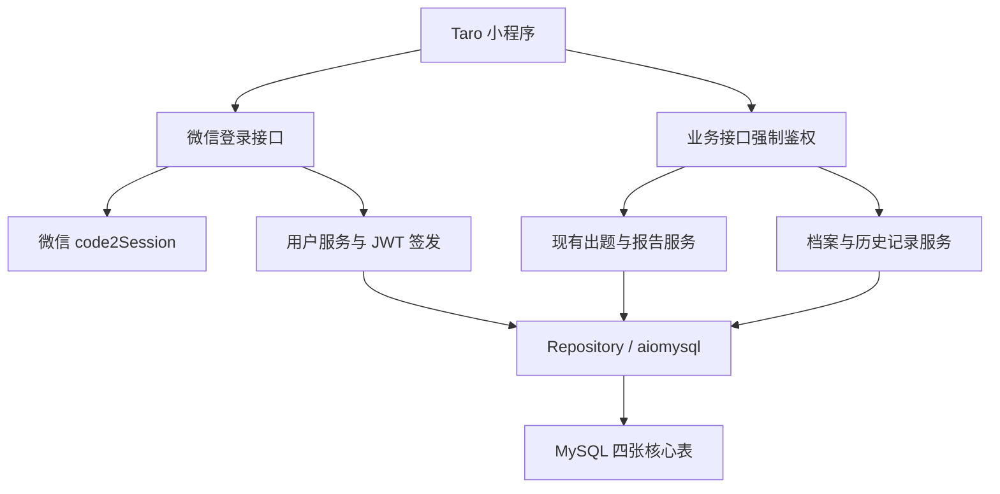

# 《开卷有戏》用户系统方案设计文档（最终版）

## 1. 文档目标

在现有“输入 → 出题 → 答题 → 报告”流程上增加用户身份、持久化和历史记录。四张表及接口沿用《用户系统方案设计文档.md》，取消匿名体验、续答和错题重练。

本文仅为设计方案，不代表已经开发或完成测试。

## 2. 设计范围

本次包含：

1. 微信静默登录，首次登录自动创建账号。
2. JWT 强制鉴权，登录后才能生成题目和答题。
3. MySQL 保存题库、整轮答题记录和报告。
4. 用户档案查询与修改、个人中心及基础统计。
5. 闯关历史列表、详情和报告回看。
6. 底部“闯关 / 学习记录 / 我的”Tabbar。

本次不包含：游客答题、未完成续答、逐题保存、错题本、错题重练、账号密码登录、排行榜、复习计划、支付、分享海报和多源输入。

经验值沿用已确认规则：**答对一题 20 XP，答错 0 XP，整轮完成后计入账户累计，不增加完成奖励。** 例如 5 题答对 4 题，获得 80 XP。

## 3. 设计原则

1. 先鉴权再调用模型，未登录或 Token 无效返回 401，不消耗模型资源。
2. 用户归属、判题和 XP 由服务端确认，不信任客户端成绩。
3. 沿用四表和 JSON 存储，整轮完成后统一提交答案，不保存中途进度。

## 4. 总体架构



生成题库时保存用户归属，整轮完成时统一保存答案、报告和 XP，历史页面读取已保存数据。

## 5. 后端方案设计

### 5.1 模块与文件结构

保留现有 `main.py`、`config.py`、`models.py`、出题与报告服务，新增用户模块：

```text
backend/app/
  main.py
  config.py
  models.py
  api/v1/routes/
    user.py
  core/
    auth.py
    db.py
  schemas/
    user.py
  services/
    quiz_service.py
    report_service.py
    user_service.py
    history_service.py
  repositories/
    user_repository.py
    quiz_repository.py
```

路由处理用户接口；`core` 管理鉴权与连接池；Service 处理登录、档案、统计和历史；Repository 封装参数化 SQL。用户请求模型放在 `schemas/user.py`，避免与现有 `models.py` 冲突。

### 5.2 数据库与连接管理

采用 **MySQL 8.x + InnoDB + utf8mb4 + aiomysql**，不引入 ORM。

连接池通过 FastAPI `lifespan` 创建，退出时执行 `pool.close()`、`await pool.wait_closed()`。配置沿用 `mysql_host`、`mysql_port`、`mysql_user`、`mysql_password`、`mysql_database`，从环境变量读取。

多表写入使用同一连接和事务，失败回滚。微信、模型调用不占用行锁；异步路由中的同步模型请求通过线程池执行。

### 5.3 核心表设计

以下字段与类型完全沿用第一份方案，不增加进度、状态或复习相关字段。

#### users

| 字段 | 类型 | 说明 |
|------|------|------|
| id | bigint | 主键 |
| openid | varchar(64) | 微信 openid，唯一 |
| nickname | varchar(100) | 用户昵称 |
| avatar_url | varchar(500) | 头像地址 |
| total_xp | int | 累计经验值 |
| created_at | datetime | 创建时间 |
| updated_at | datetime | 更新时间 |

#### quiz_sessions

| 字段 | 类型 | 说明 |
|------|------|------|
| id | bigint | 主键 |
| quiz_id | varchar(64) | 业务 quiz_id，唯一 |
| user_id | bigint | 用户 id |
| title | varchar(255) | 题库标题 |
| summary | text | 摘要 |
| user_input | text | 原始输入 |
| questions_json | json | 题目 JSON |
| created_at | datetime | 创建时间 |

#### answer_records

| 字段 | 类型 | 说明 |
|------|------|------|
| id | bigint | 主键 |
| quiz_id | varchar(64) | 关联 quiz_id |
| user_id | bigint | 用户 id |
| records_json | json | 答题记录 |
| total_questions | int | 总题数 |
| correct_count | int | 答对题数 |
| accuracy | decimal(5,2) | 正确率 |
| created_at | datetime | 创建时间 |

#### reports

| 字段 | 类型 | 说明 |
|------|------|------|
| id | bigint | 主键 |
| quiz_id | varchar(64) | 关联 quiz_id |
| user_id | bigint | 用户 id |
| report_json | json | 报告完整内容 |
| created_at | datetime | 创建时间 |

设计说明：

1. 生成题目后仅写入 `quiz_sessions`；完成整轮后写入 `answer_records`、`reports`，并更新 `users.total_xp`。
2. 题目 JSON 保存服务端生成的完整题目与答案，落库后不随客户端提交内容改变。
3. `answer_records.quiz_id`、`reports.quiz_id` 分别设唯一约束，一轮一份作答和报告，不增加字段。
4. 仅已有报告的轮次计入历史及统计；只有题库的记录不支持续答。
5. 查询按用户过滤，为用户、时间及 `quiz_id` 配置必要索引。

### 5.4 登录与鉴权

`Taro.login()` 获取一次性 code → 登录接口 → 微信 `code2Session` 获取 openid → 查询或创建用户 → PyJWT 签发 Token → 前端保存。

JWT 包含 `user_id`、`exp` 等必要信息，默认有效期 7 天。业务请求使用 `Authorization: Bearer <TOKEN>`，服务端固定签名算法，检查签名、必要字段、有效期和用户存在性。

仅登录和健康检查免鉴权，其余接口无 Token、过期或伪造 Token 均返回 401。登录失败保留首页输入并允许重试，禁止答题。AppSecret、session_key 和签名密钥不下发或记入日志。

### 5.5 用户接口设计

保持原方案的接口路径、方法和业务字段。下方响应示例为业务数据，实际继续使用项目现有 `{code, message, data}` 外层结构。

#### 1. 微信登录

`POST /api/v1/user/login`

请求：

```json
{
  "code": "<WECHAT_LOGIN_CODE>"
}
```

响应数据：

```json
{
  "token": "<JWT_TOKEN>",
  "user": {
    "id": 1,
    "nickname": "学习者",
    "avatar_url": "",
    "total_xp": 0
  }
}
```

同一 openid 返回同一账号，唯一约束防止并发重复建号。

#### 2. 获取用户档案

`GET /api/v1/user/profile`

响应数据：

```json
{
  "id": 1,
  "nickname": "学习者",
  "avatar_url": "",
  "total_xp": 80,
  "quiz_count": 1,
  "correct_count": 4,
  "average_accuracy": 80
}
```

统计仅包含已完成轮次。`average_accuracy` 为累计答对数 ÷ 累计题数，无记录时为 0；示例 XP 为 4 × 20。

#### 3. 更新用户档案

`PUT /api/v1/user/profile`

请求：

```json
{
  "nickname": "学习者",
  "avatar_url": "https://example.com/avatar.png"
}
```

仅允许修改昵称和头像地址，校验昵称长度及头像来源，不接受临时本地路径。本版不新增上传接口；无既有上传能力时，页面使用默认头像并支持昵称修改，保留头像 URL 字段。

#### 4. 获取闯关历史列表

`GET /api/v1/user/quizzes?page=1&page_size=10`

响应数据：

```json
{
  "items": [
    {
      "quiz_id": "quiz_xxx",
      "title": "RAG 入门闯关",
      "accuracy": 80,
      "question_count": 5,
      "created_at": "2026-09-06 10:00:00"
    }
  ],
  "total": 1,
  "page": 1,
  "page_size": 10
}
```

仅返回当前用户已完成记录，按题库创建时间、ID 倒序。页码从 1 开始，每页默认 10 条、最多 50 条，时间按北京时间展示。

#### 5. 获取闯关详情

`GET /api/v1/user/quizzes/{quiz_id}`

响应包含 quiz 基本信息、完整 questions、answer_records、report。不存在、未完成或他人记录返回 404。

### 5.6 现有接口改造

#### 出题接口

`POST /api/v1/quiz/generate`

1. 保持现有请求和返回结构不变，包括 `user_input`、`question_count`、`difficulty` 以及题库数据。
2. 先验证 JWT 和账号，再执行现有出题逻辑，保留题目结构及重复题校验。
3. 生成成功后关联当前用户，将完整题库写入 `quiz_sessions`；落库成功才返回成功。
4. 登录失败不调用模型，出题失败不保存半成品题库。前端防止重复点击，不自动重试出题请求。

#### 报告接口

`POST /api/v1/report/generate`

1. 保持现有 `quiz_id`、`topic`、`questions`、`answer_records` 请求字段及报告响应结构不变。
2. 强制鉴权，根据 `quiz_id` 查询当前用户题库。客户端的 `topic`、`questions` 保留兼容，但正式判题只使用数据库快照。
3. 校验答案覆盖所有题目、题目 ID 不重复、选项合法；空答案、缺题或额外题目不得结算。
4. 服务端计算对错、正确率和 XP，沿用现有确定性报告总结，不额外调用模型生成深度报告。
5. 在同一事务内保存答题记录、报告并累加 XP，任一步失败全部回滚。
6. 结算时锁定所属题库行，先检查是否已有报告；已结算则直接返回原报告，重复提交或并发请求不会重复加 XP。

参数错误返回 422，未登录返回 401，记录不可访问返回 404，冲突返回 409，服务故障返回对应 5xx；错误信息不得泄露凭证。

## 6. 前端方案设计

### 6.1 登录态与请求层

App 启动检查 Token，通过登录或档案接口确认身份。请求层从 `post()` 扩展支持 GET、PUT，统一携带 Token；401 时要求重新登录，不提供游客入口。

出题及进入答题页前必须登录。报告提交失败可在恢复同一账号后重试；账号变化时清理旧缓存，不支持中途续答。H5 本版仅用于页面预览，不开放匿名或正式答题。

### 6.2 页面与文件结构

```text
frontend/src/
  app.ts
  app.config.ts
  api.ts
  services/auth.ts
  domain/user.ts
  custom-tab-bar/
    index.tsx
    index.config.ts
    index.scss
  pages/
    index/
    quiz/
    report/
    history/
    profile/
```

- **首页**：保留输入和示例，增加真实昵称、XP、最近完成记录；未登录禁用出题。
- **学习记录**：分页展示已完成闯关，点击查看报告。
- **我的**：展示档案、统计，支持昵称编辑和历史记录入口。
- **答题页**：保留即时反馈，整轮完成后统一提交答案。
- **报告页**：保留布局，支持本轮报告及历史回看，以服务端成绩为准。

首页案例保留输入示例用途，不当作学习记录。新页面沿用现有 CSS，覆盖未登录、空数据、加载和失败状态。

### 6.3 底部 Tabbar

底部固定三个入口：**闯关 / 学习记录 / 我的**，分别对应首页、历史页和个人中心。

1. 三等分图标加文字、圆角外形、选中背景块，沿用原配色、黑描边和阴影。
2. 配置 `tabBar.custom: true`，创建 `src/custom-tab-bar`，通过 `Taro.switchTab` 跳转。
3. 按当前路由同步各实例选中态，检查样式隔离和图标打包。
4. 仅一级页面显示，答题和报告页隐藏；预留底部安全区，避免遮挡内容。

## 7. 后续开发顺序与验收

| 步骤 | 工作 | 验证方式 |
| --- | --- | --- |
| 1 | MySQL 四表、连接池、JWT | 连接释放、事务回滚、唯一约束及 Token 校验测试 |
| 2 | 登录和用户档案 | 首次与重复登录、资料修改、用户隔离测试 |
| 3 | 出题和报告持久化 | 未登录不调用模型；服务端判题；完整提交与并发结算测试 |
| 4 | 档案统计与历史查询 | XP 正确、累计正确率正确、分页和越权测试 |
| 5 | 前端登录态、页面与 Tabbar | 前端测试、TypeScript 检查、weapp 构建和真机联调 |

后续后端按 TDD 开发，数据库集成测试使用独立 MySQL 测试库。重点验收：无 Token、过期或伪造 Token 的出题请求在模型调用前被拒绝；完成 5 题答对 4 题只增加 80 XP；重复生成报告不重复奖励；伪造题目标准答案不能改变成绩；服务重启后仍可查看已完成历史。

## 8. 技术依据与约束

沿用此前经 Context7 和官方资料核实的技术用法：[Taro Tabbar](https://docs.taro.zone/docs/custom-tabbar/)、[微信登录](https://developers.weixin.qq.com/miniprogram/dev/framework/open-ability/login.html)、[头像昵称](https://developers.weixin.qq.com/miniprogram/dev/framework/open-ability/userProfile.html)、[aiomysql](https://aiomysql.readthedocs.io/en/stable/pool.html)、[PyJWT](https://pyjwt.readthedocs.io/en/stable/api.html)、[FastAPI lifespan](https://fastapi.tiangolo.com/advanced/events/)。

部署需要微信配置、MySQL、HTTPS 和合法域名。凭证仅存服务端环境变量。强制登录阻止匿名消耗；上线时还应在部署层限制出题频率与并发，约束已登录账号滥用，不增加本版表或接口。
