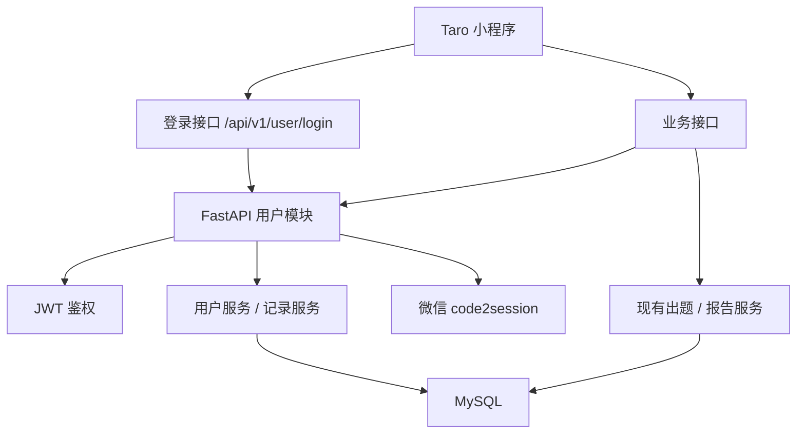

# 《鱼皮 AI 闯关学习小程序》用户系统方案设计文档

## 1. 文档目标

本文档用于指导当前项目在既有 MVP 基础上扩展用户系统，重点解决以下问题：

1. 为小程序接入可用的用户身份体系。
2. 让闯关记录、答题记录、复盘报告可以持久化保存。
3. 让首页和“我的”页面展示真实用户数据，而不是硬编码占位数据。
4. 为后续错题本、复习提醒、排行榜等用户相关功能预留稳定的数据结构。

本文档基于已确认的《用户系统需求分析文档》展开，并明确采用 **MySQL** 作为关系型数据库。

---

## 2. 设计范围

本次方案只覆盖以下内容：

1. 微信静默登录。
2. JWT 鉴权。
3. MySQL 数据持久化。
4. 用户档案接口。
5. 闯关历史列表与详情接口。
6. 前端登录态接入与个人中心展示。

本次不展开：

1. 社交 PK、排行榜。
2. 错题本、艾宾浩斯复习。
3. VIP、支付。
4. 分享海报生成。
5. 多源输入扩展。

---

## 3. 设计原则

1. **尽量少改现有核心链路**：不推翻现有“出题 -> 答题 -> 报告”流程，只在关键节点加用户关联和落库。
2. **先打通身份，再做数据利用**：没有稳定登录态，后续统计和历史记录都不成立。
3. **接口兼容匿名模式**：已有核心功能不应因登录问题完全不可用；用户系统上线后，优先支持“登录即持久化，未登录仍可体验”。
4. **结构简单但可扩展**：当前先满足 MVP 用户系统，表结构和接口命名为后续功能预留空间。
5. **前后端边界清晰**：前端负责登录态保存与展示，后端负责鉴权、持久化、统计聚合。

---

## 4. 总体架构



说明：

1. 前端启动时先走微信登录，拿到 token。
2. 后续业务接口统一带 token。
3. 出题接口和报告接口在保留原有业务逻辑的基础上，补充用户关联和数据持久化。
4. 用户中心、首页历史记录等页面直接读取后端聚合结果。

---

## 5. 后端方案设计

### 5.1 模块划分

建议在现有 FastAPI 结构中新增以下模块：

```text
backend/app/
  api/v1/routes/
    user.py
  core/
    auth.py
    db.py
  models/
    user.py
  services/
    user_service.py
    history_service.py
  repositories/
    user_repository.py
    quiz_repository.py
```

职责划分：

1. `user.py`：登录、获取档案、更新档案、历史列表、历史详情接口。
2. `auth.py`：JWT 生成、解析、鉴权依赖。
3. `db.py`：MySQL 连接池与数据库初始化。
4. `user_service.py`：用户注册、档案查询、档案更新。
5. `history_service.py`：历史记录聚合查询。
6. `repositories/`：封装数据库 CRUD，避免 SQL 散落到 service 层。

### 5.2 数据库选型

本次采用 **MySQL 8.x**。

原因：

1. 关系型数据较多，且表关系明确。
2. 历史记录、统计数据、后续排行榜都依赖良好的查询能力。
3. 比 SQLite 更适合正式业务环境和后续扩展。

推荐接入方式：

1. 驱动：`aiomysql`
2. 连接方式：应用启动时创建连接池，关闭时释放
3. 配置项：`mysql_host`、`mysql_port`、`mysql_user`、`mysql_password`、`mysql_database`

### 5.3 核心表设计

#### users

| 字段 | 类型 | 说明 |
|------|------|------|
| id | bigint | 主键 |
| openid | varchar(64) | 微信 openid，唯一 |
| nickname | varchar(100) | 用户昵称 |
| avatar_url | varchar(500) | 头像地址 |
| total_xp | int | 累计经验值 |
| created_at | datetime | 创建时间 |
| updated_at | datetime | 更新时间 |

#### quiz_sessions

| 字段 | 类型 | 说明 |
|------|------|------|
| id | bigint | 主键 |
| quiz_id | varchar(64) | 业务 quiz_id，唯一 |
| user_id | bigint | 用户 id |
| title | varchar(255) | 题库标题 |
| summary | text | 摘要 |
| user_input | text | 原始输入 |
| questions_json | json | 题目 JSON |
| created_at | datetime | 创建时间 |

#### answer_records

| 字段 | 类型 | 说明 |
|------|------|------|
| id | bigint | 主键 |
| quiz_id | varchar(64) | 关联 quiz_id |
| user_id | bigint | 用户 id |
| records_json | json | 答题记录 |
| total_questions | int | 总题数 |
| correct_count | int | 答对题数 |
| accuracy | decimal(5,2) | 正确率 |
| created_at | datetime | 创建时间 |

#### reports

| 字段 | 类型 | 说明 |
|------|------|------|
| id | bigint | 主键 |
| quiz_id | varchar(64) | 关联 quiz_id |
| user_id | bigint | 用户 id |
| report_json | json | 报告完整内容 |
| created_at | datetime | 创建时间 |

设计说明：

1. 题目、答题记录、报告仍保存完整 JSON，便于快速落地，避免前期过度拆表。
2. 核心统计字段单独冗余存储，便于列表查询和聚合分析。
3. 后续如果要做错题本，再从 `records_json` 和 `questions_json` 中拆分明细表。

### 5.4 鉴权方案

采用 **JWT** 作为会话令牌。

流程：

1. 小程序调用 `wx.login()` 获取 code。
2. 前端将 code 提交给后端 `POST /api/v1/user/login`。
3. 后端请求微信 `jscode2session`，拿到 openid。
4. 如果 openid 不存在，则自动创建用户。
5. 后端生成 JWT，内容至少包含 `user_id`、`openid`、`exp`。
6. 前端保存 token，并在后续请求中放入 `Authorization: Bearer <token>`。

策略：

1. `/api/v1/user/*` 默认要求登录。
2. `/api/v1/quiz/generate` 和 `/api/v1/report/generate` 使用可选鉴权。
3. token 无效时，用户中心接口返回未授权；核心体验接口仍可匿名使用。

### 5.5 接口设计

#### 1. 微信登录

- `POST /api/v1/user/login`

请求：

```json
{
  "code": "wx-login-code"
}
```

响应：

```json
{
  "token": "jwt-token",
  "user": {
    "id": 1,
    "nickname": "学习者",
    "avatar_url": "",
    "total_xp": 0
  }
}
```

#### 2. 获取用户档案

- `GET /api/v1/user/profile`

响应：

```json
{
  "id": 1,
  "nickname": "学习者",
  "avatar_url": "",
  "total_xp": 18,
  "quiz_count": 1,
  "correct_count": 4,
  "average_accuracy": 80
}
```

#### 3. 更新用户档案

- `PUT /api/v1/user/profile`

请求：

```json
{
  "nickname": "鱼皮同学",
  "avatar_url": "https://..."
}
```

#### 4. 获取闯关历史列表

- `GET /api/v1/user/quizzes?page=1&page_size=10`

响应：

```json
{
  "items": [
    {
      "quiz_id": "quiz_xxx",
      "title": "RAG 入门闯关",
      "accuracy": 80,
      "question_count": 5,
      "created_at": "2026-04-08 10:00:00"
    }
  ],
  "total": 1,
  "page": 1,
  "page_size": 10
}
```

#### 5. 获取闯关详情

- `GET /api/v1/user/quizzes/{quiz_id}`

响应包含：

1. quiz 基本信息
2. 完整 questions
3. answer_records
4. report

### 5.6 现有接口改造

#### 出题接口

`POST /api/v1/quiz/generate`

改造点：

1. 保持原有入参和返回结构不变。
2. 增加可选用户上下文解析。
3. 有登录态时，将题库写入 `quiz_sessions`。

#### 报告接口

`POST /api/v1/report/generate`

改造点：

1. 保持原有 AI 报告生成逻辑不变。
2. 有登录态时，将答题记录写入 `answer_records`，报告写入 `reports`。
3. 根据规则累加 `users.total_xp`。

---

## 6. 前端方案设计

### 6.1 登录态接入

1. App 启动时检查本地是否已有 token。
2. 无 token 时调用 `Taro.login()`。
3. 拿到 code 后调用后端登录接口。
4. 将 token 和基础用户信息写入本地缓存。

### 6.2 API 层改造

当前 `request()` 统一封装已经存在，可直接扩展：

1. 请求前自动读取 token。
2. 如果存在 token，则附加 Authorization header。
3. 401 时清空 token，并引导重新登录。

### 6.3 页面改造范围

#### 首页

只改这两部分：

1. 顶部问候语改为真实昵称。
2. 经验值改为真实总 XP。
3. “已完成关卡”区域改为真实历史记录。

#### 个人中心页

替换当前占位实现：

1. 头像、昵称、标语展示真实数据。
2. 统计卡展示闯关次数、答对题数、平均正确率。
3. 底部增加历史记录列表。

#### 报告页

不改 UI 主体，只增加一个能力：

1. 当通过历史记录进入时，可直接读取后端详情数据进行展示。

---

## 7. 开发顺序建议

1. 先接 MySQL 和 JWT。
2. 再完成登录接口和用户档案接口。
3. 然后改造出题/报告接口接入持久化。
4. 最后做个人中心和历史记录页面。

原因：

1. 没有身份体系，数据无法归属。
2. 没有持久化，历史列表没有数据来源。
3. 先把后端打通，再做前端展示，联调成本更低。

---

## 8. 风险与约束

1. **微信登录依赖真实小程序配置**：开发时需要有效的 AppID 和 Secret。
2. **本地联调需要 MySQL 环境**：需要准备数据库实例、账号、库名。
3. **历史详情需要兼容旧数据**：如果某些旧闯关记录没有持久化，前端需要允许空态展示。
4. **当前项目仍以快速落地为主**：前期不引入 ORM，优先直接写清晰的 SQL 和 repository 层封装。

---

## 9. 结论

本次用户系统方案采用 **Taro + FastAPI + MySQL + JWT + 微信登录** 的组合，在尽量少改现有核心业务链路的前提下，为项目补齐以下基础能力：

1. 用户身份识别
2. 闯关数据持久化
3. 首页和个人中心真实数据展示
4. 历史闯关记录回看

该方案足够简单，适合当前项目节奏；同时也为后续错题本、复习计划、排行榜等功能保留了扩展空间。
